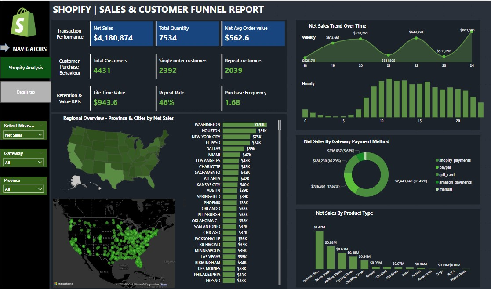

# 📊 Shopify | Sales & Customer Funnel Report

This project is a Power BI dashboard built to analyze Shopify sales data, providing actionable insights into customer behavior, sales trends, and product performance.

---

## 📝 Overview

The report focuses on several key business questions:
- What is the overall sales and order performance?
- How do sales trends change weekly and hourly?
- Who are the repeat vs. single order customers?
- Which cities, product types, and payment gateways contribute most to net sales?

This analysis helps identify growth opportunities, understand customer patterns, and support data-driven decisions.

---

## 📌 Key Insights Visualized

✅ **Transaction Performance**  
- Net Sales, Total Quantity, Net Average Order Value

✅ **Customer Purchase Behavior**  
- Total Customers, Single Order vs Repeat Customers

✅ **Retention & Value KPIs**  
- Lifetime Value (LTV), Repeat Rate, Purchase Frequency

✅ **Sales Trends**  
- Net Sales Trend Over Time (Weekly & Hourly)

✅ **Regional Overview**  
- Map and bar charts showing provinces & cities by Net Sales

✅ **Sales by Payment Method**  
- Net Sales distribution by payment gateways (Shopify Payments, PayPal, Gift Card, etc.)

✅ **Sales by Product Type**  
- Comparing net sales across different product categories

---

## 🛠 Tools & Technologies

- Power BI Desktop
- Data visualization & interactive dashboards
- Data modeling and transformation (Power Query)

---

## 📂 Project Files

| File | Description |
|-----|-------------|
| `Shopify_sales_Report.pbix` | Power BI report file |
| `Shopify Sales.csv` | Dataset used for analysis (if shared) |
| `README.md` | Project documentation (this file) |
| `Sales_Analysis.jpg` | Screenshot of the dashboard |

---

## 📷 Dashboard Preview



---

## 🚀 How to Use

1. Clone the repository:
   ```bash
   git clone https://github.com/your-username/shopify-sales-report.git
